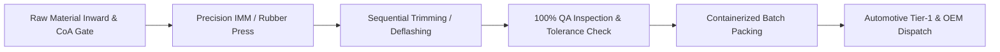
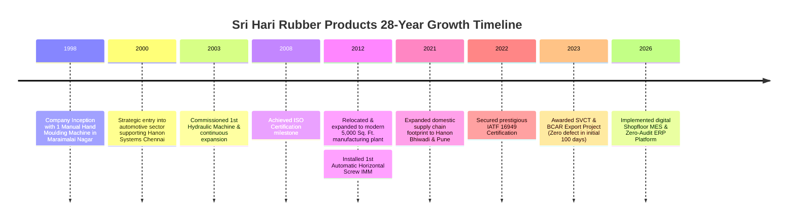

# 🏭 SRI HARI RUBBER PRODUCTS (SHRP)
### **MANUFACTURER OF PLASTIC & RUBBER MOULDED COMPONENTS**
#### **AN IATF 16949 Certified TIER-II Automotive Supplier**


> **Factory Address**: Plot No-2, Survey No-22/1c, Thirukachur Main Road, Peramanur, Maraimalai Nagar, Chengalpattu Dist, TN – 603209  
> **Communication Address**: 12/44, LLIG NH-1, Sundarar St., Maraimalai Nagar, Chengalpattu Dist, TN – 603209  
> **Plant Head**: **Sakthivel Alagappan** &bull; 📱 **9940099469** (WhatsApp) / **9444123248**  
> **Emails**: `alsakthivel@sriharirub.com` / `sriharirub@yahoo.co.in`  
> **Official Web**: `www.sriharirub.com` &bull; **GST**: `33AHKPA6556E1ZL`  
> **Major Clients**: **Hanon Systems**, **Onegene**, **Comstar Automotive Technologies**, **Wonjin Autoparts**, **Avadh Rail Infra**, **VK Industries**  
> **Annual Capacity**: **30+ Million Precision Components** | Immediate 2X Scalability  

---

## 📌 Executive Summary

Established in **1998 in Maraimalai Nagar**, Tamil Nadu, **Sri Hari Rubber Products (SHRP)** brings over **28+ years of precision industrial manufacturing leadership** as a certified Tier-II automotive partner. Operating a modern **5,000 sq. ft. IATF 16949 certified facility**, Sri Hari Rubber Products specializes in high-precision, tight-tolerance injection moulded plastic components, technical retaining fasteners, HVAC protective shipping caps, and custom-formulated elastomeric/rubber moulded dampers.

Sri Hari Rubber Products components are integrated into major vehicle assembly lines across **Maruti Suzuki India (MSIL), Hyundai Motor India, Kia Motors, Volkswagen (VW), Ford Global, and Mahindra & Mahindra**, supporting direct export projects to **South Korea and Europe**.

---

## 📊 Core Operational Metrics

| Metric | Specification / Capacity |
|---|---|
| **Company Name** | **SRI HARI RUBBER PRODUCTS** |
| **Industry Standing** | 28+ Years Manufacturing Excellence (Est. 1998) |
| **Annual Plant Output** | **30,000,000+ Parts / Year** (Scalable to 60M+) |
| **Active Part Master** | **77+ Precision Production Parts** (43+ Core Series) |
| **Clamping Force Range** | **40 Tons (Vertical) to 120 Tons (Horizontal)** |
| **Shot Weight Capacity** | **Up to 190 Grams** |
| **Tool Envelope Capacity** | **Up to 420 &times; 420 &times; 520 mm** |
| **Quality Certification** | **IATF 16949:2016 Certified** (5-Stage Gating & Digital Traceability) |
| **Major Clients** | **Hanon Systems**, **Onegene**, **Comstar**, **Wonjin Autoparts**, **Avadh Rail Infra** |
| **Delivery Record** | **100% On-Time In-Full (OTIF)** with Zero-Defect Gating |

---

## 🎯 Strategic Vision, Mission & Quality Policy



### 🔭 Strategic Vision
To empower our global automotive clients by delivering zero-defect, world-class engineered products and establish industry leadership in precision injection moulding through advanced technology and sustainable manufacturing.

### 🚀 Core Mission
- Provide 100% on-time delivery with zero customer PPM.
- Continuously advance injection moulding technology and multi-cavity tooling.
- Cultivate a highly skilled, motivated workforce certified on IATF 16949 standards.

### 🛡️ Quality Policy
- **Customer-Centric Growth**: Deep collaboration with automotive design and assembly engineers.
- **Operational Excellence**: Strict digital MES stage gating (**Moulding $\to$ Trimming $\to$ Inspection $\to$ Packing $\to$ Dispatch**).
- **Tool Life Management (TPM)**: Automated shot accumulation with preventive maintenance alerts at 10k, 50k, and 100k shots.

---

## 📈 28-Year Historical Growth Milestones (1998 – 2026)



---

## 🏭 Manufacturing Machinery & Plant Infrastructure

| Equipment Type | Model & Spec | Clamping Force | Qty | Key Production Focus |
|---|---|:---:|:---:|---|
| **Horizontal Screw IMM** | Automatic Microprocessor Controlled | 50 Ton – 120 Ton | 5 Units | Multi-cavity shipping caps, retainers, clips |
| **Vertical Screw IMM** | Precision Insert & Vertical Clamping | 40 Ton | 2 Units | Insert moulding, delicate cable guides |
| **Semi-Auto & Toggle** | Semi-Automatic Toggle Machines | Custom | 3 Units | Specialized runs & secondary operations |
| **Rubber Compression Presses** | Heated Multi-Platen Compression | High Tonnage | Multi-Station | NBR grommets, EPDM bumpers, silicone masks |
| **De-flashing / Trimming** | Dedicated Precision Trimming Stations | Manual/Pneumatic | 4 Stations | 100% Flash-free edge finishing |
| **QA Calibration Vault** | Digital Micrometers, Calipers, Pyrometers | Calibrated Vault | 1 Lab | First-Piece Approval & continuous SPC audit |

---

## 🧪 Material Processing Capabilities

### 🔹 Engineering Thermoplastics
- **LDPE (Low-Density Polyethylene)**: High flexibility, impact resistance & chemical sealing for shipping caps.
- **HDPE (High-Density Polyethylene)**: High structural rigidity, tensile strength for suction plugs and covers.
- **PPCP / PP (Polypropylene)**: High fatigue endurance, integral hinge resilience for HVAC covers and casings.
- **Nylon (PA66 / PA6)**: High mechanical strength, heat resistance up to 150&deg;C for engine fasteners and clips.
- **POM (Polyacetal / Delrin)**: Low friction coefficient, dimensional precision for high-wear sliding latches and snap-fit assemblies.
- **ABS & PVC**: Rigid structural parts and flexible protective plugs.
- **TPE (Thermoplastic Elastomers)**: Flexible sealing caps for international export programs.

### 🔸 Moulded Rubbers & Elastomers
- **Nitrile Rubber (NBR)**: High resistance to fuel, oil, grease, and hydraulic fluids.
- **EPDM Rubber**: Superior weather, ozone, UV, and high-temperature environmental stability.
- **Silicone Rubber**: Broad thermal rating (-50&deg;C to +200&deg;C) for masking caps, grommets, and electrical vibration dampers.
- **EPM**: Chemical and electrical insulation seals.

---

## 📦 Verified Production Catalog (Weights Rounded Up & No Cavities)

### 1. Automotive HVAC Shipping & Protection Caps

````carousel

<!-- slide -->

<!-- slide -->

<!-- slide -->

<!-- slide -->

<!-- slide -->

````

| Part Code | Customer Part No | Raw Material | Part Weight | Std Pack | Application & Customer |
|---|---|---|:---:|:---:|---|
| **LAC Blue** | `HC442L3LAC01` | LDPE Virgin (Blue) | **5 g** | 400 pcs | AC Evaporator tube seal (Hanon Chennai / Pune) |
| **LBC** | `HC442L3LBC02` | LDPE Virgin | **8 g** | 150 pcs | AC Condenser protective shipping cap (Hanon) |
| **LBB** | `HC442L3LBB01` | LDPE Virgin | **7 g** | 250 pcs | Fluid line connection seal |
| **QQVBA Y** | `HC443QQVBA02-Y`| LDPE (Yellow) | **2 g** | 750 pcs | Line ID & compressor line barrier (Hanon) |
| **QQVBA W** | `HC443QQVBA02` | LDPE Natural Virgin | **2 g** | 750 pcs | Compressor fluid line shipping cap |
| **QVEAC** | `HC442QVEAC01` | LDPE | **2 g** | 1000 pcs | Automotive quick-connect protective plug |
| **QVEBC** | `HC442QVEBC01` | LDPE | **2 g** | 1000 pcs | High-speed automated line dust cap |

---

### 2. Precision Automotive Retaining Clips & Fasteners

````carousel

<!-- slide -->

<!-- slide -->

<!-- slide -->

<!-- slide -->

<!-- slide -->

````

| Part Code | Customer Part No | Raw Material | Part Weight | Std Pack | Application & Customer |
|---|---|---|:---:|:---:|---|
| **A710** | `A710-BBWBA-01` | Nylon PA66 | **6 g** | 250 pcs | Harness & tube retainer (Hyundai / Kia) |
| **F364 16C** | `F364-CB5AA-01` | Nylon PA66 | **3 g** | 400 pcs | HVAC casing fastener (Wonjin / Hanon) |
| **F364 GS** | `F364-CB5AA-01-GS`| Nylon PA66 | **3 g** | 400 pcs | Trim retaining guide (Wonjin Autoparts) |
| **F442 KQ** | `F442-KQAAA-01` | Nylon PA66 / POM | **5 g** | 200 pcs | Heater core rear cover holder bracket |
| **F442 QQ** | `F442-QQ7AA-01` | Nylon PA66 | **4 g** | 300 pcs | Automotive module clamp (Wonjin) |
| **F442 WB** | `F442-WBAAA-01` | Nylon PA66 / POM | **4 g** | 300 pcs | HVAC bracket support |
| **F710** | `F710-AKYAA-01` | Nylon PA66 | **4 g** | 400 pcs | Engine compartment harness bracket (Hanon) |
| **F885 Y** | `F885-BB1AA-01` | PP / POM | **3 g** | 500 pcs | Body panel snap-fit fastener |
| **R230 NCBB** | `R230-NC5BB-01` | High Impact Nylon | **7 g** | 105 pcs | Under-hood tube guide mount |
| **R230 NCBA** | `R230-NC5BA-01` | High Impact Nylon | **6 g** | 200 pcs | Under-hood heavy-duty fastener |

---

### 3. OEM Global Platform Caps (Volkswagen, MSIL, Ford)

````carousel

<!-- slide -->

<!-- slide -->

<!-- slide -->

<!-- slide -->

````

| Part Code | Customer Part No | Raw Material | Part Weight | Std Pack | OEM Platform Integration |
|---|---|---|:---:|:---:|---|
| **VW Dia 16**| `HW773G9E1A01` | PPCP / LDPE | **2 g** | 1000 pcs | **Volkswagen Global Platform** HVAC Caps |
| **VW Dia 8** | `HW773G9E1B01` | PPCP / LDPE | **1 g** | 3000 pcs | **Volkswagen Global Platform** Line Seals |
| **MSIL 2100**| `V0LC-01C021-00`| LDPE | **2 g** | 750 pcs | **Maruti Suzuki (MSIL)** AC Port Seals |
| **MSIL 2800**| `V0LC-01C028-00`| LDPE | **3 g** | 500 pcs | **Maruti Suzuki (MSIL)** Component Caps |
| **MSIL 1901**| `V0LC-01C019-01`| LDPE | **2 g** | 600 pcs | **Maruti Suzuki (MSIL)** HVAC Protection |
| **MSIL 2200**| `V0LC-01C022-00`| LDPE | **2 g** | 750 pcs | **Maruti Suzuki (MSIL)** Line Seals |
| **Ford VPFA** | `VP5N1H-407721-FA`| LDPE / TPE | **3 g** | 500 pcs | **Ford Global** Vehicle AC Line Assembly |
| **Ford VPAA** | `VP5N1H-407721-AA`| LDPE / TPE | **2 g** | 650 pcs | **Ford Global** Protective Terminal Cap |

---

### 4. International Export Programs (SVCT & BCAR - Korea & Europe)

````carousel

<!-- slide -->

````

| Part Code | Customer Part No | Raw Material | Part Weight | Std Pack | Export Target & Details |
|---|---|---|:---:|:---:|---|
| **NA-DB** | `WC-SCP-SC21NA-DB-01` | TPE / PVC | **3 g** | 500 pcs | **SVCT South Korea Export Project** |
| **NA-TB** | `WC-SCP-SC21NA-TB-T01` | TPE / PVC | **4 g** | 300 pcs | **BCAR European Automotive Export** |
| **NA-LC** | `WC-SCP-SC21NA-LC-01` | TPE / LDPE | **2 g** | 750 pcs | International Tier-1 HVAC Assemblies |
| **DA** | `WC-SCP-ECC21-DA01` | LDPE | **3 g** | 500 pcs | Export Platform Sealed Connector |
| **LMF** | `WC-SCP-ECC21-LMF01` | LDPE | **3 g** | 650 pcs | Precision export line termination cap |
| **SMM** | `WC-SCP-eCC21-Smm01` | LDPE | **3 g** | 500 pcs | Export secondary port seal |

---

### 5. Technical Mouldings, Suction Plugs & Rubber Dampers

````carousel

<!-- slide -->

<!-- slide -->

<!-- slide -->

<!-- slide -->

<!-- slide -->

````

| Part Code | Customer Part No | Raw Material | Part Weight | Std Pack | Application & Customer |
|---|---|---|:---:|:---:|---|
| **DH7AA** | `HR230DH7AA01` | HDPE Rigid | **8 g** | 100 pcs | Heavy-duty AC compressor suction plug (Hanon / Onegene) |
| **PDPKA** | `HR230PDPKA02` | HDPE Rigid | **10 g** | 100 pcs | High-torque industrial vent cover |
| **UGKCA** | `FC1F2UGKCA01` | POM / Nylon PA66 | **1 g** | 1500 pcs | Miniature automotive sensor guide clip |
| **CXGAA** | `HC442CXGAA01` | PP (Polypropylene)| **4 g** | 250 pcs | Automotive HVAC bracket casing clip |
| **DM1C** | `DM1C4UBH1B01` | ABS / POM | **2 g** | 750 pcs | Front bumper grille & rivet mask plug |
| **HA715** | `HA715L5G1A01` | HDPE / ABS | **5 g** | 200 pcs | Front vent grille retainer clip |
| **SHRP-T8** | `SHRP-T8 / VK Grommet`| Nitrile NBR / EPDM| **3 g** | 500 pcs | Vibration damper, door buffer & grommet |
| **SHRP-T7** | `SHRP-T7` | EPDM / NBR | Custom | 2000 pcs | Door closure cushion & tailgate bumper |

---

## 🔒 Confidentiality & Security Notice

> [!IMPORTANT]
> This document and all technical part profiles contained herein are **PROPRIETARY & CONFIDENTIAL** property of **SRI HARI RUBBER PRODUCTS**. Unauthorized reproduction, reverse-engineering, commercial distribution, or copying is strictly prohibited under international trade and industrial property protection laws.
